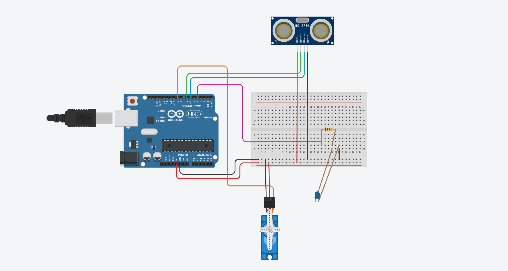
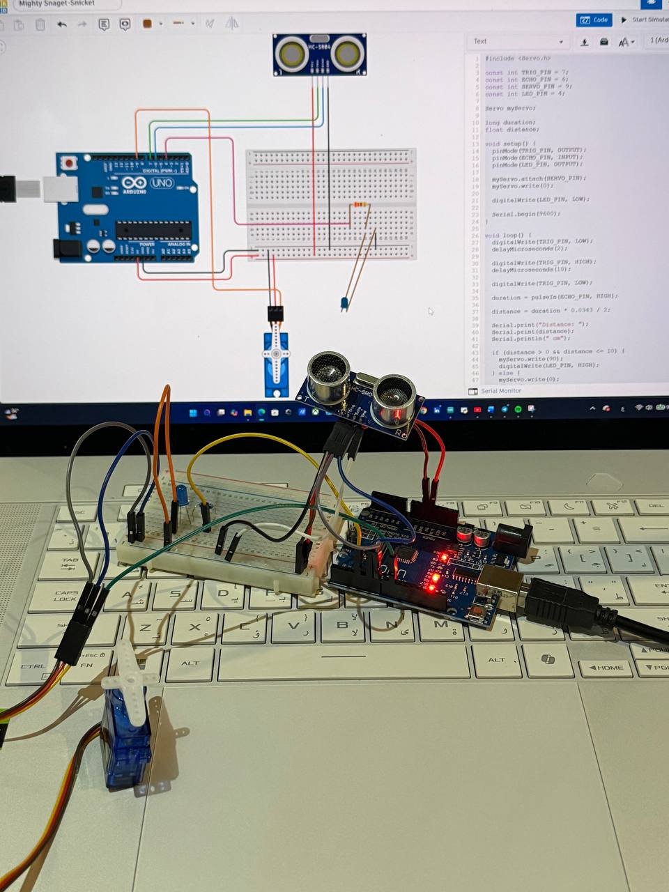

# Servo Ultrasonic Object Detection

An Arduino-based object detection system using an HC-SR04 ultrasonic sensor to control a servo motor and an LED. When an object is detected within 10 cm, the servo motor moves to 90 degrees and the LED turns on. When the object moves farther away, the servo returns to its original position and the LED turns off.

## Project Features

- Measures distance using the HC-SR04 ultrasonic sensor.
- Detects objects within 10 cm.
- Moves the servo motor from 0° to 90°.
- Turns on the LED when an object is detected.
- Displays the measured distance in the Serial Monitor.
- Returns the servo to 0° when the object moves away.

## Components

- Arduino Uno
- HC-SR04 Ultrasonic Sensor
- Servo Motor
- LED
- 220Ω Resistor
- Breadboard
- Jumper Wires
- USB Cable

## Pin Connections

### HC-SR04 Ultrasonic Sensor

| HC-SR04 Pin | Arduino Connection |
|---|---|
| VCC | 5V |
| TRIG | Digital Pin 7 |
| ECHO | Digital Pin 6 |
| GND | GND |

### Servo Motor

| Servo Wire | Arduino Connection |
|---|---|
| Signal | Digital Pin 9 |
| Power | 5V |
| Ground | GND |

### LED

| Component | Arduino Connection |
|---|---|
| LED Anode (+) | Digital Pin 4 through 220Ω resistor |
| LED Cathode (-) | GND |

## System Operation

1. The ultrasonic sensor continuously measures the distance of objects.
2. If the measured distance is between 2 cm and 10 cm:
   - The servo motor moves to 90°.
   - The LED turns on.
3. If the object is farther than 10 cm:
   - The servo motor returns to 0°.
   - The LED turns off.
4. The measured distance is displayed in the Serial Monitor at 9600 baud.

## Circuit Diagram

## Practical Implementation

## Demonstration Video

[Watch the project demonstration](Servo_Ultrasonic_LED_Demo.MOV)

## Project Files

- `Servo_Ultrasonic_LED.ino` — Arduino source code.
- `Servo_Ultrasonic_LED_Circuit.png` — Circuit diagram.
- `Servo_Ultrasonic_LED_Practical.png` — Practical circuit image.
- `Servo_Ultrasonic_LED_Demo.MOV` — Demonstration video.

## How to Run

1. Connect the components according to the circuit diagram.
2. Open `Servo_Ultrasonic_LED.ino` using Arduino IDE.
3. Select **Arduino Uno** from the Board menu.
4. Select the correct COM port.
5. Upload the code to the Arduino.
6. Open the Serial Monitor and select `9600 baud`.
7. Move an object closer to or farther from the ultrasonic sensor.

